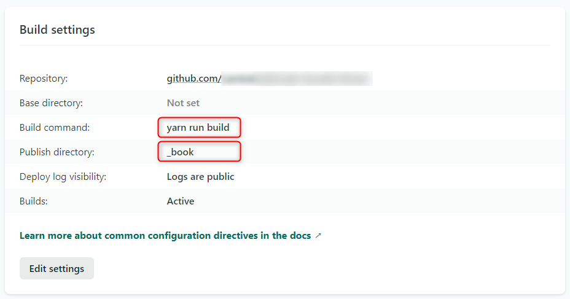
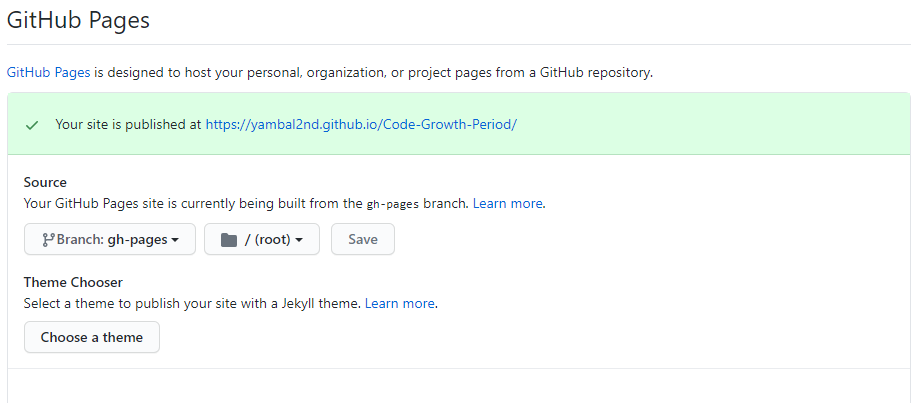

# HonKitでビルドしたコンテンツを公開する

## Netlify
Netlifyは、静的サイトをホスティングすることができるWebサービスです。GitへのPush（変更）を検知して自動デプロイしてくれます。

つまり、Markdownを編集しPushすると、それをトリガーにビルドが実行され、公開まで自的に行います。

仮に、HonKitのビルドコマンドが`yarn run build`で、出力先が`_book`ならば、Build setting は以下のようになるでしょう。


## GitHub Pages
GitHub PagesはGitHubが提供するホスティングサービスで、ウェブページをインターネット上に公開することができます。

とても便利な機能なのですが、公開ディレクトリには`/root`と`/docs`しか選択できません。
対してHonKitの方は`/_book`固定となっています。
そこでちょっと小細工が必要です。

### `gh-pages`モジュールを追加
`gh-pages`は指定したディレクトリを`gh-pages`ブランチにPushするというモジュールです
```
yarn add gh-pages --dev
```
以下のnpm-run-scriptsの場合、`_book`ディレクトリを`gh-pages`ブランチにPushすることになります
```
  "scripts": {
    "deploy": "gh-pages -d _book",
  }
```
GitHub Pagesの設定は以下のようになるでしょう
